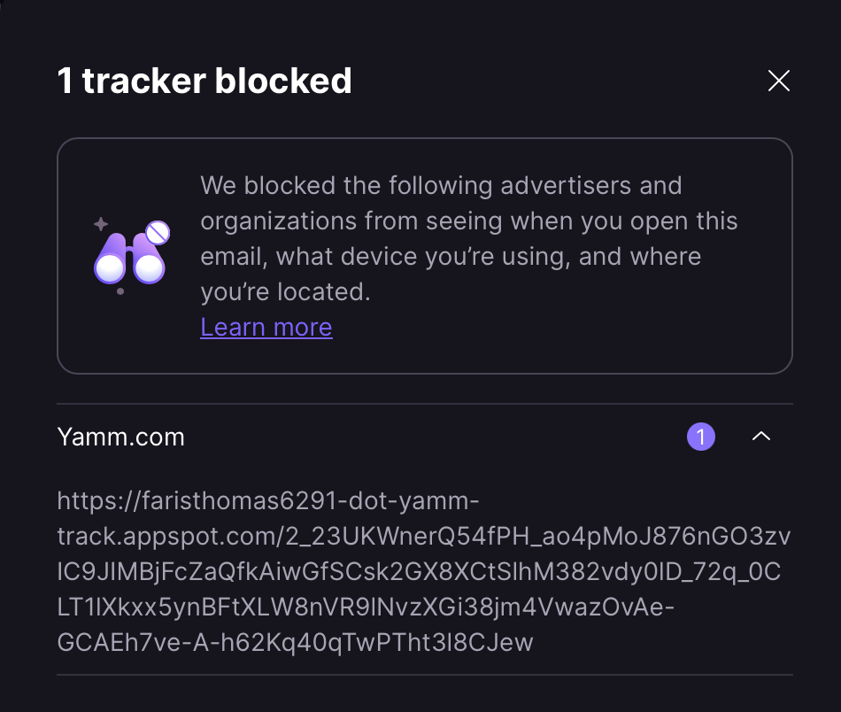

I get more than my fair share of spam. Of course, I "mark as spam", but then I
also report the sender to both their email provider and their email tracker (if
they have one). My hope, especially with the email trackers, is that I can
increase the cost of _supporting spammers_ on these platforms that enable them.

## Reporting Abuse to Email Services

I typically get spam from throwaway email addresses on major email services like
gmail and hotmail. These email services have policies against spamming, so you
can report them.

1. **Gmail** https://support.google.com/mail/contact/abuse
2. **Hotmail** send a message to abuse@outlook.com with the offending message
   attached.
3. **Other** look-up at https://www.abuse.net/

For reporting by email, I use the template.

> Reporting Unsolicited Spam with No Opt-Out
>
> The attached message was sent to me as unsolicited spam with no opt-out.

## Reporting Abuse to Email Tracking Services

Like any email campaign, spammers sometimes use an email tracking service to
measure the effectiveness of their campaign. I use Proton Mail, and it shows me
which trackers it has blocked in a given message.

Yet Another Mail Merge is a favorite for spammers, despite having a no-spam
policy in place. I create a
[new support ticket with them in the "Security / Legal category"](https://support.yet-another-mail-merge.com/hc/en-us/requests/new?ticket_form_id=360000785860).

Here's the template I use:

<dl>
<dt>Business Impact</dt>
<dd>Moderate</dd>
<dt>Summary</dt>
<dd>Reporting Abuse: YAMM Used in Spam Campaign</dd>
<dt>Description</dt>
<dd>One of your users is sending unsolicited spam with no opt-out from address &lt;spammer&gt;@gmail.com. They're tracking their spam campaign using YAMM tracker &lt;URL-to-tracker&gt;. I’ve attached the email.</dd>
</dl>

## Summary

Of course, spammers don't care if they get their throwaway email address
blocked. But, the email services that enable spammers do care when they need to
spend resources processing abuse reports. Consider joining me in raising the
cost of supporting spammers.
