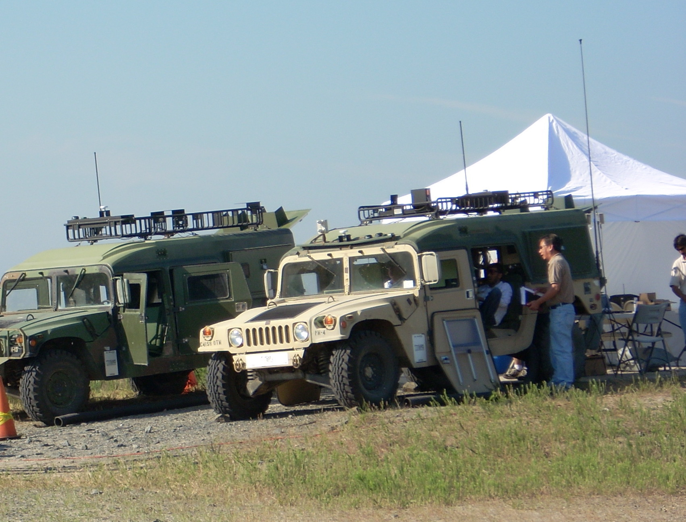

In the summer of 2005, as an incoming high school senior, I started my
internship at US Army Communications Electronics Research and Development
Engineering Center. I returned to CERDEC each break I had from school until I
graduated college and accepted a full time position at CERDEC. My mixture of
academic study and apprenticeship (and later employment) at CERDEC has been an
invaluable experience.
