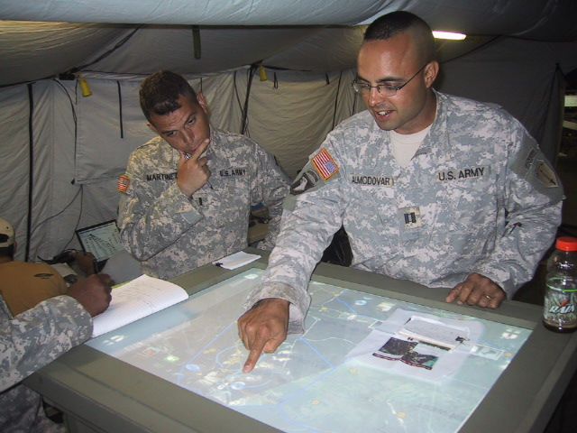

I [co-authored a paper](http://www.dtic.mil/cgi-bin/GetTRDoc?AD=ADA503423 Army
Science Conference paper) with my teammates for the 2008 Army Science
Conference. The paper describes a research effort we undertook to develop a
multi-touch, multi-user system to facilitate face to face collaboration in a
command and control environment. This research effort was a good experience for
me: I got to work closely with a lot of smart engineers on the prototype
pictured here; I also worked closely with the users to develop the application
layer and make adaptations based on their immediate feedback. I learned a lot
about what it takes to make simple, intuitive user interfaces. In 2010, our team
received CERDEC's Employee of the Year award (team category).
