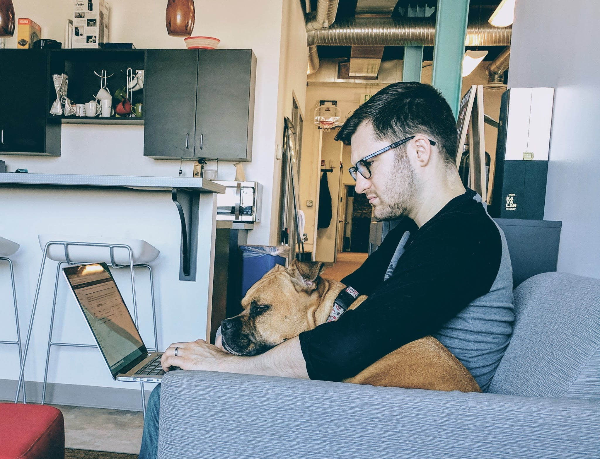

As often happens at start-ups, my role at Contrast Security changed to meet the
company's new needs. In February 2018, I stepped away from backend service
development and took on the role of Principal Engineer for Contrast's Java agent
team.

Developing a Java agent is a challenging problem. Developing an agent which
instruments low-level Java APIs for secure data flow analysis, as Contrast does,
is even more difficult! Performance is always a first-class concern. Testing
Java agents has its own unique challenges. This is an exciting project to work
on.
