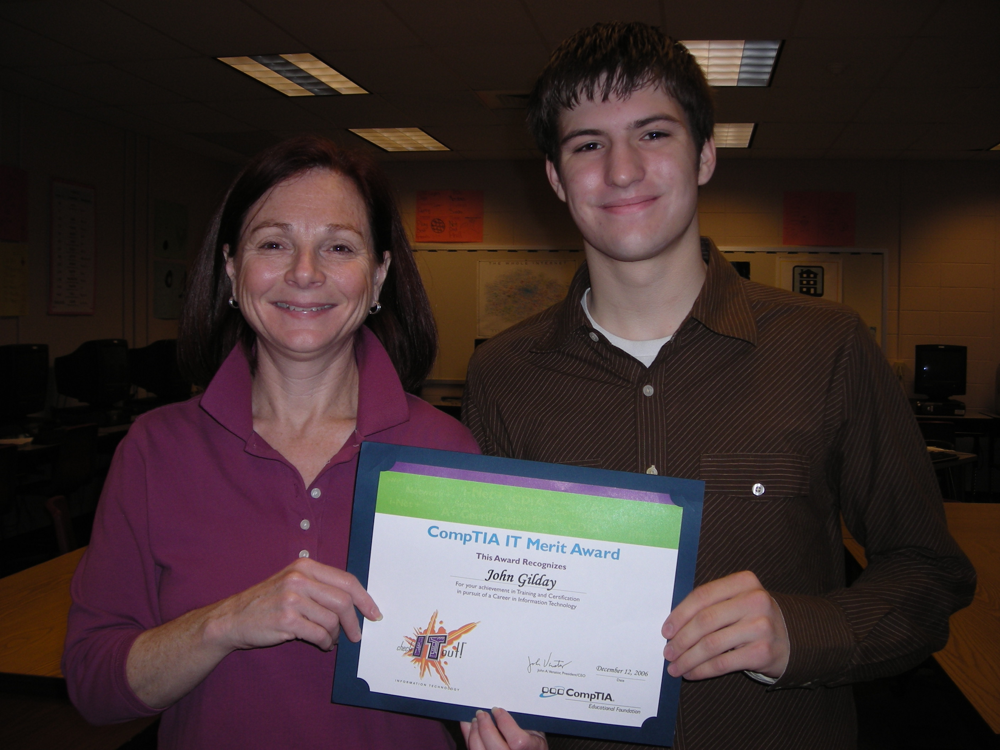

In high school, I was fortunate enough to have access to interesting technology
electives. One of the electives, taught by the fantastic Mandy Galante, prepped
my classmates and me for the CompTIA Security+ exam which I passed at the end of
the semester. Thanks to Mrs. Galante nominating me, I also received the CompTIA
Merit Award from the CompTIA Educational Foundation.
